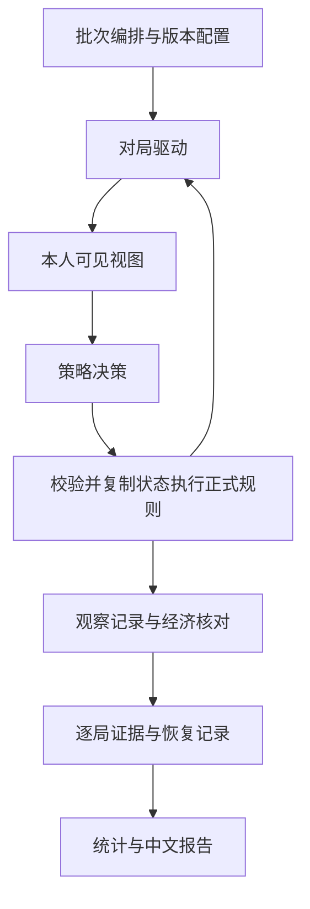

# 玩法胜率平衡验证：技术设计提案

> 文档状态（2026-10-02）：本文批准目标或过程提案保留，当前开发/启动 T1–T82 已完成；正式抽样按用户要求停止，T83 停止，T84/T85 未完成，T86 记录完成但整体验收未完成。新批终止 63 局（42 自然、21 截断、0 异常），2 待恢复；不能把计划 4200 局当作已执行。最新依据见 [进度](progress.md)、[部分验收](acceptance.md)、[停止快照](stopped-summary.json) 与 [项目现状](../项目现状.md)，不自动续跑。

> 2026-10-01｜依据已批准的spec.md v1.0；全部技术设计段落已获用户确认，正式plan.md已汇总，整份待审批。当前仅设计文档，没有实现代码。

## 架构划分

### A1 批次编排与恢复

统一生成同策略座位基线、四偏好交叉对局及全部座位排列。正式运行前保存配置、版本、样本清单、成组种子、单局上限及整批预算。

每个计划样本有稳定标识，按固定、交错的执行顺序分批运行，使预算不足时不会只运行某一种人数或路线。保存已完成结果及未完成状态；恢复时校验配置和版本，已完成样本不重算入统计。异常重跑保留原证据与尝试标识，修复工具后另立版本批次，不用成功重跑覆盖原异常。

### A2 正式规则对局驱动

从`createGameState`、`resetDeck`及`opportunities.beginOpportunityStage`启动正式v2开局，复用现有`normalizeAction`、`resolveActorId`、`gameLogic.apply`、费用报价及资产核算。

驱动层选择真正应行动者；机遇阶段逐个处理尚未提交的存活参与者，拍卖、购买与转让确认按原授权参与者推进。行动先做身份和当前阶段/报价校验，再在复制状态上执行，核对经济不变量和状态进展，成功后提交并更新修订号；拒绝或异常保留原状态和复现证据。

采用现有可注入时钟构造确定性的本地决策环境，正常自动玩家立即响应，不等待真实30秒。断线、过期、重复提交等联机行为继续由正式网络回归覆盖；它们不混入策略胜率抽样。

批量入口不启动HTTP或Socket服务器，不操作真实房间；复用可直接调用的规则模块。用受控对照测试将代表性动作序列同时交给本地驱动与正式服`runAction`，比较状态、金额、修订及拒绝结果，检查适配层与正式流程的一致性。受控测试证据与正式抽样分开。

### A3 决策与经营偏好

策略只接收现有`gameView.snapshot`生成的公开和本人视图、固定策略配置、独立决策随机源及自身行动记忆；不能接收完整内部状态或观察器记录。

采用共用的基本经营与债务处理逻辑，分别配置地产、投资、航线、稳健偏好。所有策略支持正常购置、建设、股票、航班、拍卖、转让、募资、自救和选择流程；偏好改变估值、资金储备和操作优先级，具体决策规则在接口与技术决策段给出。

同策略基线使用统一的中性经营配置，首阶段从本人合法候选随机选择，并固定相同的换组规则；后期选择与资产状态单独记录。策略输出一个动作与结构化理由，供审计经营差异和主动放弃，不以直接修改状态实现策略。

### A4 观察记录与经济核对

独立观察器读取动作前后状态、正式事件和策略理由，记录候选/选择阶段、资讯、机遇适用条件/额度/触发、经济流水、存活状态、资产、个人回合和绕圈数。它有审计权限，但不向策略返回信息。

优先使用已有结构化结算事件和费用计划，补充必要的前后状态差异核对；不能只用事件文案解析关键金额。机遇触发按实际结算、额度和奖励记录，适用机会按事件对应的前置状态核对，不能将“持有机遇”视作“已经触发”。

每局结束记录自然完赛、截断或异常；中断中的局保存为待恢复状态。保存逐局摘要、版本/配置与可重放动作依据，必要流水独立留存；截断只记录当时资产，不调用正式终局结算制造收益。

### A5 统计与中文报告

从保存的计划清单和逐局结果生成报告，不依赖运行过程中的临时计数。先核对实际覆盖、终止分类与胜场数，再按人数、座位、路线、机遇阶段及主要组合汇总。

报告分别呈现两种胜率、完赛/截断/异常率、资产、触发与实际收益、局长及不确定性。成组种子和同局玩家按依赖样本处理；多重比较、后期存活、小样本和策略依赖在相关结论附近说明。具体统计方法、样本目标、阈值与预算在后续技术决策段提出并确认。

风险建议附对应样本与流水；当前规则数值保持原版本。正式记录、受控分支测试、调试批次和重跑审计各有来源标识，统计入口只纳入指定正式批次的一次有效结果。

## 数据流与依赖

观察器到策略没有信息通道。报告读取保存的证据，不回头改变策略或游戏规则。正式服与模拟器的对照测试作为验证层，不进入生产对局的执行链。

## 需求归属

| 需求 | 负责模块 |
|---|---|
| F1 合法完整对局 | A2、A3；对照测试验证 |
| F2 结果分类 | A2、A4、A5 |
| F3 座位公平性 | A1、A3、A5 |
| F4 四偏好比较 | A1、A3、A4、A5 |
| F5 机遇与组合 | A3、A4、A5 |
| F6 抽样与复现 | A1、A2、A4 |
| F7 经济与局长 | A4、A5 |
| F8 风险建议 | A5 |
| F9 验证交付 | A1、A4、A5；原有回归门禁 |

## 核心数据与接口

### D1 运行配置与计划样本

`RunConfig`保存：

- `schemaVersion`、`ruleVersion: 2`、`policyVersion`、`analysisVersion`、`codeFingerprint`；代码指纹含提交与相关源文件内容摘要，输出文件不参与指纹。
- `runId`、`source`（`formal`、`controlled`、`debug`、`audit`）、`seedGroups`、`schedule`、`policyConfigs`、`choiceRules`。
- `limits`（完整轮数、成功动作数、单局计算预算、整批计算预算）、`sampleTargets`、`screeningRules`、`reportSeed`；具体值在技术决策段确定。
- `configHash`：对规范化配置计算摘要，不包含生成时间、进度和输出路径。恢复必须匹配配置、代码及策略版本。

`GameSpec`包含`sampleId`、`groupId`、`players`、`policiesBySeat`、`engineSeed`、`policySeedsByPlayer`、`choiceRule`、`source`、`limits`。稳定`sampleId`由运行配置及计划坐标确定，`groupId`标识共用随机输入的一组座位排列；不同尝试另有`attemptId`，不能新增正式统计样本。

接口：

- `buildSchedule(config) -> GameSpec[]`：生成可核对的固定、交错计划。
- `runBatch(config, {resume, onProgress}) -> RunManifest`：逐局运行、保存结果和进度，恢复只处理尚未完成的计划样本。
- `RunManifest`保存计划样本数、各样本状态（待执行、运行中、已终止）、尝试记录、配置摘要、耗时及预算停止原因。运行中断不是胜负分类。

### D2 对局会话与行动结果

`createSession(gameSpec) -> Session`从正式开局初始化；内部持有完整状态、游戏随机源、每人独立决策随机源、虚拟时钟、修订号和成功动作流水。只读观察器可审计内部状态，策略不能取得会话对象。

`Session`接口：

- `nextActor() -> playerId | null`：普通阶段按正式规则指定参与者；机遇阶段选尚未提交的存活参与者；终局返回空。仍未终局且无法解析阶段时报告异常。
- `view(playerId) -> DecisionView`：复用`gameView.snapshot`及当前时钟视图，返回脱离内部引用的数据副本；移除不供经营决策使用的生成时间和连接标识，不增加隐藏字段。
- `dispatch(playerId, decision) -> ActionOutcome`：封装当前`gameId/actionId/decisionId/actorRevision`，执行`validateEnvelope`、`normalizeAction`、复制状态的`gameLogic.apply`和经济不变量检查，并核对实际授权参与者。成功后更新修订及同步决策时钟；失败不提交状态。
- `finishIfNeeded() -> GameResult | null`：先识别正式自然终局，再检查预设对局上限；仍可继续时返回空。工具错误返回异常，资源预算停止与失败分开记录。

`ActionOutcome`保存`ok`、`actorId`、`step`、原始与规范化动作、动作前后阶段/修订、事件、拒绝或异常原因、随机调用计数及语义状态摘要。副本执行失败时保留原状态；正式样本出现失败立即分类为异常，不能反复改动作直到成功来隐去问题。

会话采用现有`createActionClock`的可注入时间与定时器；成功动作引发的时钟同步遵循正式决策描述。批量策略即时响应，不以动作数量推动虚拟时钟制造超时。真实网络缓存、掉线与超时机制继续由已有回归及对照测试核验。

### D3 策略输入与输出

`decide(view, policyConfig, memory, policyRng) -> Decision`为策略唯一入口。

`DecisionView`含现有公开棋盘、城市/机场/股份、玩家现金与资产、当前阶段与待处理目标、当前资讯及已公开预告、公开已选机遇；本人部分含候选/已提交状态、机遇额度、费用报价及股票窗口预算。没有骰袋、未公开资讯池、其他人的候选或待确认选择、身份凭据。

`Decision`包含：

- `action`：现有游戏动作与所需报价/窗口/候选版本，不使用测试专用动作制造资产或机遇。
- `reason`：理由编号、目标、估值、预算/储备、相关可见条件与主动放弃原因。
- `nextMemory`：本人本回合操作标记、已考虑或放弃的目标、报价与选择依据。不能存放其他人私有数据。

策略可用确定性的本人随机源处理平分估值或候选随机选择；同策略基线规则对所有座位相同。策略不调用驱动层内部状态或观察器；阶段、报价和额度最终由正式校验再次确认。

### D4 观察记录与金额流水

`observeTransition(before, outcome, after, decisionReason) -> Observation[]`仅在审计侧调用；它不参与动作生成。

`Observation`按用途分别记录：

- `choice`：阶段、候选、换组、提交和实际统一生效时点，选择时现金、资产、存活人数；候选出现与最终生效选择分开计数。
- `opportunity`：玩家、机遇、阶段、对应回合/绕圈、适用条件、剩余额度、实际触发次数及金额。触发按真实结算、奖励或成功远程动作；H1等操作权限不虚构现金奖励。
- `eligibility`：针对实际决策或被动结算时点，记录未满足条件、满足且有额度、额度耗尽、实际使用；主动放弃必须有对应策略理由。被动效果自动结算，不标记为主动放弃。不可观察的解释记为未知，不补成零。
- `economy`：玩家现金变化、银行现金流、玩家间转移、待分红基金变化、原始费用与优惠、资产成交及当时资产估值；各项有动作/结算依据与来源标识。
- `progress`：正式完整轮次、个人实际行动回合、跳过回合、个人绕圈、出局时点及资产；不从事件文案或动作总数猜回合数。

结构化费用与奖励事件为主要凭据。旧GO、罚款、购置等缺少结构化金额的分支，用规范化动作、前后状态和已核对的规则分支补足，保留依据并核对现金差；不能用单条总现金差猜所有收支。未知或不能对账的金额列为观察错误，不能继续形成精确收益结论。

`EconomyEntry`包含`step`、`settlementRef`、`kind`、`playerId`、`counterpartyId`、`cityId/airportId`、`cashDelta`、`bankFlow`、`fundDelta`、`baseAmount`、`finalAmount`、`effects`、`source`。拆分条目需要保留同一结算引用；汇总避免将优惠、银行补足和资产收入重复相加。

### D5 逐局结果、检查点与重放

`GameResult`包含：

- 样本/组/尝试标识、来源、人数、座位与策略、版本与种子、配置摘要。
- `outcome`（`natural`、`censored`、`error`）、终止原因、最后阶段、成功动作数、完整轮次、个人回合及绕圈、耗时。
- `winnerId`仅自然完赛非空；各玩家存活、出局次序、现金、规范资产分项、机遇及经济汇总；截断资产明确为停止时观察值。
- 自然终局的正式结算事件、语义状态摘要、流水位置及错误上下文。

`Checkpoint`保存运行中的样本/尝试标识、配置/代码指纹、已完成动作前缀及摘要、各随机源调用计数、策略记忆和进度；正式输出以原子写入保存，完整动作可连续落盘。

`replayGame(gameSpec, actionPrefix) -> ReplayCheck`按原种子从正式开局重放动作，恢复虚拟决策时钟与记忆，核对每一步语义摘要及随机调用计数。通过后继续原计划样本，已完成批次直接跳过。中断后的不完整末条记录只保留为审计材料，不能作为成功动作；已有完整记录不覆盖。

游戏随机源与每人策略随机源分别记录种子和调用计数；继续使用现有`createRng`算法，不为配对对局另改骰子或资讯分布。同一组共用种子只是分组依据，不保证不同策略分支产生相同后续随机结果。

语义比较将本局生成的`gameId`及其派生的阶段/结算标识映射为统一标识，排除生成时间、连接标识及未参与规则的随机元数据；保留阶段、修订、报价内容、经济、已公开与内部随机进度等玩法字段。原始标识仍保存在审计记录，真实动作校验使用实际标识。

### D6 统计入口与输出

- `aggregate(manifest, gameResults, analysisConfig) -> BalanceSummary`：校验来源、版本、唯一计划样本、终止分类和数量；异版本、缺失或重复条目不能静默合并。调试/受控/审计结果默认排除，原始失败不能被后续审计成功覆盖。
- `writeReport(summary, evidenceIndex) -> ReportArtifacts`：输出中文报告与结构化汇总，链接或索引到逐局证据。
- `BalanceSummary`包含目标/执行/待恢复数量、自然完赛/截断/异常率、各人数座位、交叉路线、机遇各阶段、主要组合、经济与局长、样本不确定性、覆盖限制及风险建议。零自然完赛的条件胜率为`null`并显示“不可计算”，不是0。

统计方法、固定样本规模、运行预算及筛查阈值在后续技术决策段确认后填入具体运行配置；本段只确定数据职责与接口，不提前开展抽样。

## 模块交互与执行流程

### I1 创建批次与正式开局

1. 校验配置、相关代码指纹、输出位置和样本唯一性，生成计划及成组种子；在首局执行前保存这些资料。
2. 按固定交错顺序取出待执行样本，落盘运行中标记；已有终止结果不再作为新样本执行。
3. 创建正常2至4人状态，按正式顺序洗机会卡、生成首次机遇候选，再同步虚拟决策时钟。保存初始化后的语义摘要及随机调用计数。
4. 观察器记录首次候选及公开状态；策略只接收本人的决策视图。首阶段所有参与者完成后，正式引擎统一生效，再进入首回合。

### I2 单次决策与状态提交

1. 驱动先检查自然终局与确定性对局上限；仍可继续时解析真正应行动者。
2. 获取该玩家当前公开与本人视图及本人记忆，用独立策略随机源生成一个动作和理由。候选、报价与窗口版本来自本次视图。
3. 用真实当前标识封装动作；核验操作封装、当前阶段及规范化结果中的授权参与者。普通阶段的参与者不能冒充转让买家或拍卖竞买者。
4. 复制状态并调用正式规则，执行经济不变量和状态变化检查；失败则保留原状态及失败动作，结束该次正式样本为异常，不用备用动作掩盖问题。
5. 成功时提交复制状态、增加全局及参与者修订，并同步时钟。拍卖与直接出售响应使用正式服相同的新决策同步方式；同一机遇阶段的其他人提交不刷新尚未提交者的阶段时限。
6. 观察器核对事件及动作前后差异，产生金额、机遇和回合记录；策略记忆仅提交本人的决策结果。
7. 保存成功动作、策略理由、记忆、随机计数、状态与观察摘要，完成检查点，再进入下一次决策。观察失败单独标记原因与已成功执行的状态，列为工具异常；不能继续输出无法核对的精确收益结论。

### I3 回合边界与后续机遇

完整轮次、股票窗口关闭、资讯推进、后续机遇与跳过回合均由正式引擎推进；驱动不直接调用回合结束或资讯推进函数来跳阶段。

引擎进入机遇阶段时，暂停普通经营决策，按固定参与者顺序取得各自独立视图。已提交者不再行动；每次提交均保留选择时状态，机遇是否实际生效以引擎统一结算事件为准。顺序提交不会让后提交者看到他人未生效的选项。

股票买卖、转让确认与债务处理可由多条合法动作完成；直到引擎实际结束该回合才记一次结束。观察器结合`turnId`、`roundFlow`及动作前后状态记录已完成回合、跳过回合和出局，不将阶段动作数当成回合数；单次动作可能推进多个跳过回合，需逐项核对。

### I4 自然终局、截断与资源停止

- **自然终局优先**：正式引擎已结束、唯一存活者与胜者一致时，记录引擎已完成的终局结算。驱动不再次派息或排序指定胜者。
- **确定性对局上限**：达到批准的完整轮数或成功动作数上限且没有自然终局时，记录截断和当时阶段、资产、存活者；不认输、不解散、不调用`finalizeGame`补发终局收益。
- **计算时间预算**：到达单局或整批运行预算时保存检查点并暂停执行，标记待恢复及预算原因。它不改变自然胜负，也不作为固定种子的游戏终止结果；相同逻辑上限的重放继续得到可复现结果。
- **异常**：未识别阶段、无授权参与者、非法动作、引擎失败、真正无状态进展或观察不能核对时，保留完整失败上下文与最后成功检查点。正常长局依确定性上限截断，不按经济停滞猜异常。

### I5 保存与中断恢复

正式流水使用逐条完整记录，摘要、检查点与清单采用临时文件后原子提交。按“动作凭据保存→检查点→逐局终止结果→清单状态”顺序写入；只标记清单已结束而没有对应有效结果时不能视为完成。

恢复先核对配置、代码与记录完整性，再从种子和动作前缀重放未完成样本。重新执行当时策略决策以恢复各策略随机进度，比较决策、引擎结果、记忆和摘要；一致才继续。不能只强制执行旧动作却跳过策略随机调用。

阶段、窗口及报价中包含的本局标识，在重放比较时按本局标识映射；提交动作使用重建会话中的有效标识和同一经济版本，不把原对局过期报价直接提交到另一会话。相关经济字段或版本不同即视为重放不一致，不自动接受新价。

落盘存在完整动作但检查点尚未更新时，通过重放校验补齐；不完整末条原样留存为恢复审计，另建后续有效记录段。有效动作前缀不删除、不重复执行进正式统计。已终止结果可做独立审计重跑，但不能覆盖原结果或增加正式样本数。

### I6 汇总与风险报告

先核对清单与逐局结果、版本、来源、唯一性、终止原因及胜场，再做统计。报告分别列计划未执行、运行中待恢复和已终止样本；对已终止样本核对自然完赛、截断与异常总数。

零自然完赛时只报告开局中的自然胜场占比、未完赛情况和经济表现，条件胜率显示不可计算。异常或观察缺失不能被当作零收益样本来得出机遇弱势结论。

统计按人数和计划组合分开，后两阶段机遇按选择状态分层；代表性流水附在相关风险结论后。报告生成过程不更新策略，不修改正式规则，也不触发线上房间或正式记录保存。

### I7 对照与回归验证

开发中用标明`controlled`来源的独立场景，对照本地驱动与正式服的开局、授权参与者、费用/窗口版本、修订、状态及结算。对照差异先保留证据并修正适配，不能将不一致场景列为有效平衡抽样。

工具实现及对照通过后冻结正式批次版本与策略，执行批准样本并按原有规则、联机、浏览器和静态检查门禁验收。批次发现错误时保留旧版本结果；修复后使用新版本批次，报告交代重跑原因和覆盖情况。

## 关键技术决策：经营策略

### K1 共用决策能力与偏好参数

五份配置（中性基线及四种偏好）使用同一个合法动作决策流程；下表参数仅影响自动玩家的选择，不改变任何正式规则、价格或费用。

| 配置 | 基础现金储备 | 城市估值系数 | 建设估值系数 | 股票资产比例上限 | 航班机会估值系数 |
|---|---:|---:|---:|---:|---:|
| 中性基线 | 15000 | 1.05 | 1.05 | 25% | 1.0 |
| 地产 | 12000 | 1.20 | 1.20 | 20% | 0.9 |
| 投资 | 22000 | 1.00 | 1.00 | 40% | 0.9 |
| 航线 | 15000 | 1.05 | 1.05 | 20% | 1.4 |
| 稳健 | 30000 | 1.00 | 1.00 | 15% | 0.8 |

实际储备＝基础储备＋`min(12000, ceil(当前可见最高他人城市实际租金 × 0.5))`。租金依据本人报价，排除本人城市与抵押城市；无他人正额租金则附加储备为零。储备只限制主动新增投资，不妨碍缴纳已发生债务和自救。股票资产比例按现有规范资产中的持股分项计算。

城市估值＝当前标准城市总价值×城市系数＋配套价值；完成至少两座同色非抵押城市加该城市地价10%，与自有机场形成对应邻城组合再加地价10%。稳健偏好已选H10且购买会从两城增至三城时，扣除6000估值，表示放弃未来三次起点奖励的决策成本；它仍可因更高价值而购买，不硬性禁止持有三城。

建设估值＝标准单级建房费×建设系数＋最近三轮该城正额实际租金均值的20%；与当前合法报价中的实际费用比较。这个公式是可审计的经营启发式，不是获利保证；报告收益以正式结算为准，不拿估值系数当实际收入。

所有主动投资要求估值不低于支出且支出后现金不低于实际储备；同分目标使用本人随机源选取，不按地块编号或座位固定打破平分。阶段无合格投资时执行原有放弃/结束/掷骰动作。

### K2 各阶段动作顺序

1. **等待掷骰**：优先在当前合法位置赎回有经营价值的自有抵押城市，再比较合法普通建设与H1远程施工的估值减实际费用，执行最佳合格项；没有合格项则掷骰。记录本回合已执行或放弃目标，避免抵押/赎回、建房/拆房来回循环；不靠人为禁止正常购置、建设或远程操作区分策略。
2. **购买与建设询问**：遵守全员绕圈解锁、每圈购买额度和合法报价；按估值与储备买入城市/机场、建设，或明确放弃。机场估值以正式15000价值为基准，已有对应邻城加3000，航线偏好再加3000。不能付款时，仅在购置值得且合法募资能恢复购买及储备条件时进入募资，不能为了维持买入频率强制借款。
3. **冻结与监狱**：付款后能保留实际储备时付款恢复行动，否则冻结跳过、监狱尝试正常掷骰出狱；不读取骰袋决定是否掷骰，也不利用自动认输结束长局。
4. **股票窗口**：先卖出因储备不足或超过股票比例上限而需减持的股份，再按公开最近三轮租金/分红、待派股息和本人H5/H6配套价值排序买入。每股经营估值取`G + floor(D/20) + min(round(G×10%), floor(最近三轮租金均值×20%/20))`；H5三城分散配套优先补尚未持股的合格城市，H6优先他人有正租金城市。买入必须满足储备、持股比例、窗口三城/六股/每城两股、总发行量及城主四股限制；持股比例不足空间时不买。
5. **减持与股票转让**：优先减持公开收益较低或抵押城市股份；同一窗口同城不反复买卖。需要减持且有合法接收方时，可先报价转让一城一股，协商价为当前公开股价的95%取整；买方按同样估值、储备及股份规则决定是否接受。每窗口只提出一次转让以避免反复被拒；拒绝后按原窗口继续正常交易，不能反复赠送或无偿资助特定座位。
6. **航班**：对所有合法机场用公开棋盘评估下一次普通单骰1至10点落点，按等权启发式比较可购城市价值、本人可建设城市价值与本人预期租金支出；只用公开点数范围，不推断实际袋内剩余。各落点的经营机会取正的估值减支出，收益不能重复算持有资产价值。目标得分＝机会估值系数×平均经营净机会－平均租金支出－本次实际机票及已知机场费；优于停留且能保留储备才飞行，否则放弃。H8不因飞行触发，不能把它计为航班奖励。
7. **拍卖与直接购买**：当前真正应行动者按城市估值和现金储备出价/接受。拍卖出当前合法最低价，不超过估值与储备预算；已有最高价且轮到本人时按原规则结束。不把同一回合的原玩家代入竞买者现金。
8. **募资与自救**：募资仅使用该阶段允许的抵押/拆房，必要额度与完成购买条件不足则取消。已发生债务优先按足以补足缺口的最少股份减持，再抵押估值损失较小城市、拆除合格低收益房屋、合法出售/拍卖；选项金额和资格来自当前公开及本人报价。动作后重新读取状态，能继续则继续；无合法资产可补足时才`rescue_done`，不因策略储备要求放弃救援。

每种偏好都能使用以上能力。罕见分支通过受控场景证明能够正确决策；正式样本没有满足条件时报告未触发，不能强迫使用以增加触发次数。

### K3 机遇选择、换组与策略冻结

中性基线三个阶段均从本人当前合法候选等概率选择，**不换组**；首阶段作为主要机遇比较，后期另分层。随机选择不把候选第一项固定当成偏好，所有座位规则相同。

四种经营偏好的候选基础分：

| 偏好 | 优先机遇与基础分 | 其余机遇 |
|---|---|---|
| 地产 | H1 90、H2 80、H3 75 | H11 65、H12 55，其余40 |
| 投资 | H5 90、H4 80、H6 75 | H11 65、H12 55，其余40 |
| 航线 | H9 90、H7 80、H8 75 | H11 65、H12 55，其余40 |
| 稳健 | H11 90、H10 85、H12 75、H6 65 | 其余40 |

当前满足配套条件时加15分：H1已有合格自有城市；H3已有两座同色非抵押城市；H5已持股三城且符合条件；H6已持有有正租金的他人城市股份；H9已有至少一组机场与非抵押邻城；H10当前至多两城。H8每个已访问并消耗过奖励的机场扣5分。分数只读本人已公开资产与状态，选最高分，同分用本人随机源。

仅首次阶段候选最高分低于60且本人仍有换组次数时换一组；换组后必须从新候选选择，不连续换组。后两阶段不换组。换组记录与对应游戏随机调用保留，不能将四偏好有目的选择后的原始胜率当成随机分配能力实验。

正式批次开始前冻结以上策略与版本。开发检查可纠正非法动作或工具缺陷，另立版本保留旧证据；正式统计中不能因某偏好胜率不理想就改变储备、估值或机遇顺序。报告明确这些是四种有限启发式，不能代表所有玩家策略。

## 关键技术决策：抽样、统计与运行

### K4 固定样本计划

正式目标共**4200局**，不以胜率结果或显著性决定是否加局或提前结束：

| 实验 | 每组设置 | 局数 | 独立种子组数 |
|---|---|---:|---:|
| 2人中性同策略 | 600个种子，每种子1局 | 600 | 600 |
| 3人中性同策略 | 600个种子，每种子1局 | 600 | 600 |
| 4人中性同策略 | 600个种子，每种子1局 | 600 | 600 |
| 2人四偏好交叉 | 6种配对×40个种子×2种座位排列 | 480 | 240 |
| 3人四偏好交叉 | 4种三人组合×40个种子×6种座位排列 | 960 | 160 |
| 4人四偏好交叉 | 四偏好同场×40个种子×24种座位排列 | 960 | 40 |
| **合计** |  | **4200** | **2240** |

基线只采用中性配置，所有座位首阶段随机合法选择、不换组；十二项机遇观察来自这些自然候选和选择，不指定或替换候选池。组合和后期机遇不另加受控样本充数。

种子由固定前缀`balance-v1-20261001`、实验、人数、偏好组合与种子序号经SHA-256派生32位整数；生成计划时检查不同独立组的游戏种子碰撞，使用递增盐确定性消除碰撞，保存最终种子。交叉实验同一组合内共用种子的所有座位排列是一组，其他组合使用不同种子。

策略随机源独立派生；换位时同一偏好保留该组对应的决策种子，中性基线为每个座位派生不同决策种子。策略不能获得游戏种子、未来随机流或组内其他对局结果。报告用独立组数描述有效覆盖，不把24种排列当成24个独立随机种子。

执行顺序按实验和种子轮次交错，组内依次完成全部排列。开发冒烟、调试及罕见分支场景另标来源，不计入4200局；正式批次前冻结计划、策略、观察器与分析版本。样本目标用于风险筛查，不能保证每项机遇都有足够自然完赛样本。

### K5 逻辑上限、预算与停止条件

- 单局确定性上限：**500个已完成完整轮次或20000条成功动作**，先达到者触发截断；同一步已经自然终局时自然终局优先。记录确切上限及停止阶段，不把500轮作为正常局长目标。
- 本轮正式抽样、重放审计与汇总的累计计算预算：**240分钟**；人工等待、电脑挂起和开发/回归测试不计入，实际运行片段与恢复重放计入。预算用完保存进度并交付已运行报告，不自动增加预算。
- 单个对局运行片段最多**60秒**，达到后保存检查点并轮转到其他待执行组；恢复可继续剩余动作。重放前缀消耗计入总预算，不占该片段继续执行的60秒，以避免长前缀导致永远无法推进。
- 验证专用输出最多**2GiB**；余额不足或写入失败保存可用进度并停止新动作，报告具体原因。不删除既有证据或压缩其他用户文件腾空间。完整流水分段保存，可用Node内置gzip压缩已封闭段以控制占用；检查点引用流水段，不每次重写完整动作前缀。
- 正式样本出现第一条非法动作、执行异常、观察对账失败或重放不一致，先保存该异常结果并暂停批次排查；不能继续大量制造无效样本。适配缺陷修复后新建版本批次，旧批次结果保留，所用总预算继续累计；规则行为变更仍需先修订审批。
- 完成全部4200个终止结果、达到计算/存储预算、运行中断或遇到上述工具错误时停止；不根据胜率好坏停止。预算/中断导致的运行中样本单列，不伪装成逻辑上限截断。

运行预算是上限，不是耗时预测。预算内完成量不足时仍交付覆盖情况与真实结果，超预算追加运行须另行确定；本轮不会以降低自然完赛上限或修改获胜规则来凑齐胜场。

### K6 统计方法与比较族

各人数、偏好组合分开计算；同时保留全体实际开局中的自然胜场占比和已自然完赛中的条件胜率。待恢复样本计入开局覆盖并使结果标为暂定，另列当前已终止样本分母；正式条件胜率不能将未结束资产领先者算成胜者。

采用固定报告随机种子`0x5b1a2026`、**50000次按独立种子组重采样**：每次抽取整组所有座位排列及同局玩家，按原实验/组合分层，重算比率与差值；不能打散玩家或单独抽取依赖排列。中性基线一组就是一局。区间采用重采样分位数，展示普通95%区间，明确为有限样本的近似估计。

预先固定三类主要比较族；族内采用Bonferroni规则，将每项区间尾概率设为`0.05/(2m)`，不能看到结果后减少比较数：

| 比较族 | 预定比较 | m |
|---|---|---:|
| 座位 | 2/3/4人中性基线的每个座位条件胜率减各自`1/n` | 9 |
| 经营偏好 | 2人六配对各1个差值；3人四组合各3个两两差值；4人6个两两差值 | 24 |
| 首阶段机遇 | 每种人数下12项机遇的选择者与未选择者条件胜率差，均来自随机选择中性基线 | 36 |

三族分别校正，并标明不是对报告所有指标统一保证的95%总体区间；重采样区间近似性不会因采用Bonferroni而变成精确保证。全体开局自然胜场占比在座位基线中对应的均匀参考是`该批次自然完赛率/n`，不能直接拿未完赛很多的开局占比与`1/n`比较。

首阶段机遇差值按相同人数、座位标准化后计算：分别统计各座位选择/未选择该机遇的自然胜率，再按座位等权求差。每次重采样重算这些分母，同局竞争与重复选同项机遇保留在整组内。任何座位必要分母为零，则该比较不可计算，不用零填补。它是当前策略与候选机制下的关联筛查，不宣称能力独立因果强度。

第二、第三阶段按人数、选择阶段、当时存活人数及个人资产层分开；资产层固定为不超过150000、150000至300000、超过300000，同时列个人资产名次。只提供条件关联及收益分布，不加入主要机遇比较族。三类主要组合也只做探索观察。

比率分母为零、重采样有效计算率低于99%、区间分布退化或独立组不足时，标记区间不可稳定估计，不能输出看似确定的强弱结论。未执行完的计划及未完成种子组全部保留在覆盖报告，相关主要比較结论降级为证据不足；不选择性去掉慢局后宣称显著。

收益、资产和局长报告样本数、均值、中位数、P10/P90及极端流水；自然完赛与截断分开。持有机遇的多个玩家不能当作多个独立完整对局。汇总用金额和次数分子/分母，不平均已经四舍五入的百分比。

### K7 证据门槛与风险筛查

下列是本轮预设筛查门槛，不是等强证明或保证能检出某种效应的功效计算：

| 项目 | 支持主要强弱比较所需条件 |
|---|---|
| 座位 | 对应600局计划完成、至少200局自然完赛、自然完赛率至少80%、无工具异常 |
| 经营偏好 | 对应组合全部排列计划完成、至少30个完整独立组及60局自然完赛、自然完赛率至少80%、无工具异常 |
| 首阶段机遇 | 对应基线计划完成、选择与未选择两侧分别至少100名自然完赛玩家、各侧至少80个独立组、每座位各侧至少10名自然完赛玩家、自然完赛率至少80%、无工具异常 |

未达到门槛或区间不稳定时，主要结论为**证据不足**，同时仍展示实际差值、截断和触发情况。自然候选样本不足的机遇不额外指定发放补样本；2人部分机遇可能达不到门槛，需要在报告中明确。

达到门槛后：

- **明显风险**：座位差绝对值至少5个百分点，或偏好/首阶段机遇差绝对值至少10个百分点，且对应族内校正区间不含零；附经济解释和复现样本，只指当前自动策略环境。
- **观察到趋势**：差值达到上述实际幅度、普通95%区间不含零，但族内校正区间含零；需要追加独立证据，不能直接据此削弱某机遇。
- **本次未发现明显风险**：门槛满足且未达到上述条件；保留区间与检出能力限制，不称为已证明等强。达到实际幅度但普通区间含零时，明确写“差值较大但方向仍不确定”。

局长与可用性另设观察警报：任一完整实验截断率至少20%，或自然完赛局长P90至少250完整轮次；某机遇至少100次生效选择、30个实际具备条件且有额度的使用时点，但使用比例低于10%；或至少100次选择且80%以上玩家整局从未满足条件。它们分别提示长局、决策使用或难触发风险，不直接判定机遇强弱。中断局不当作整局无法触发。

远程/建设、持股/防御、机场/邻城组合至少来自30个独立组时可描述分布与代表性风险；不足时照样列样本和流水，并标明组合证据不足，不进行组合胜率排行榜。

### K8 本地实现与审计范围

继续使用CommonJS、Node 20及现有正式规则模块；文件组织在正式plan.md列出，再在task.md拆成可验证任务。不引入生产运行时依赖或外部统计服务。

金额累计只使用整数并核对安全范围，统计百分比最后展示时取整；规范资产复用现有`assetSummary`。机遇优惠、银行补足、现金奖励和资产成交分别记录，不把同一补贴重复计入收益。

保存所有正式样本的紧凑动作/理由/摘要/观察流水和异常上下文，不为所有步骤保存重复完整状态。代表性完整状态可由重放恢复；每种人数在正式结果中按稳定样本编号选首个自然完赛、首个截断及实际异常进行审计重放，缺失类别如实说明。受控场景另验证全部三种终止分类；不能为得到自然完赛证据而制造胜者。

## 方法依据与适用限制

区间与校正参考[NIST重采样说明](https://www.itl.nist.gov/div898/software/dataplot/refman1/auxillar/bootplot.htm)及[NIST Bonferroni方法](https://www.itl.nist.gov/div898/handbook/prc/section4/prc463.htm)。保留依赖数据分组的依据参考[NIST研究：数据依赖对不确定性的影响](https://tsapps.nist.gov/publication/get_pdf.cfm?pub_id=911725)。

将游戏种子组视为重采样单位、4200局目标和各筛查门槛是本项目设计选择，不是这些来源给出的游戏结论。有限固定种子、有限启发式、后期存活和自然完赛筛选均限制推广到真人的范围。

## 下一步

正式plan.md已汇总，含文件组织、接口、命令行、模块依赖及需求覆盖，等待整份审批；批准后进入task.md拆解。
