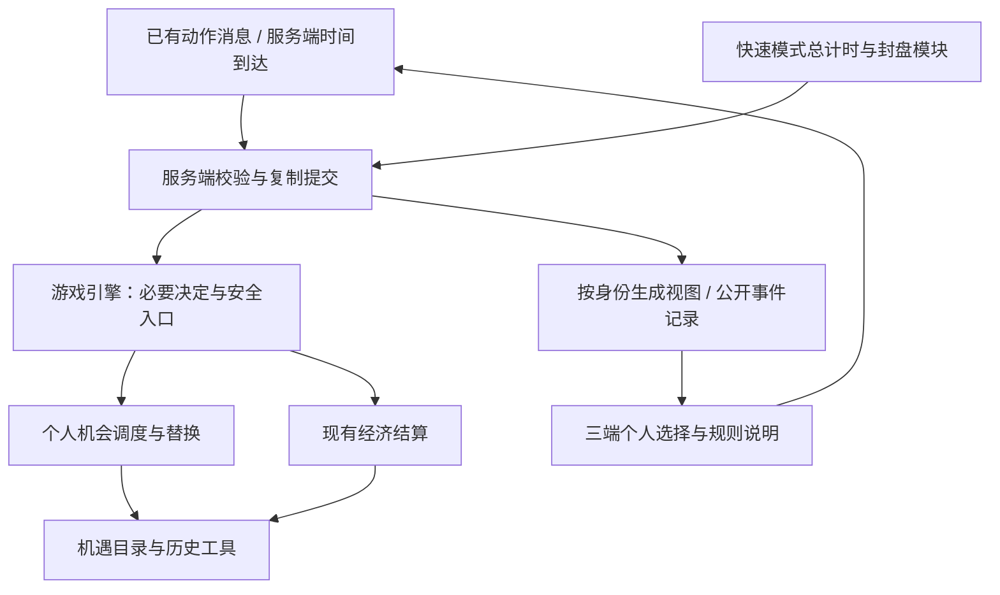
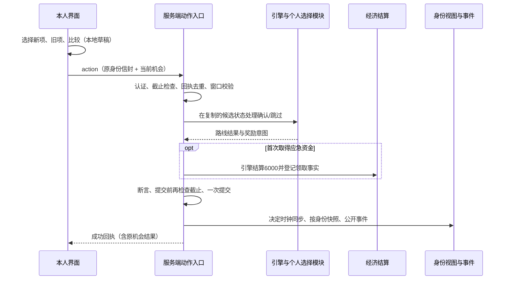

# 后续经营机遇：换路线 Plan

版本：v1.0  
更新：2026-10-09（Asia/Shanghai）  
输入：[已批准spec v1.0](spec.md)  
状态：正式技术设计与任务拆解已批准，验收清单已批准，按任务开发。普通实现及适用验收完成；快速受控适配已验证、真实集成待Q1；见acceptance.md。

## 设计范围与阅读顺序

本计划实现普通模式的后续换路线，以及快速模式的机遇时点与封盘适配。快速核心的房间选择、总计时、30分钟封盘和净资产排名属于独立依赖；未接入时不开放快速入口，也不将全部验收记为通过。经营任务、股票经营预期和离线推进整改分别规划。

先读A段架构与需求归属，再读D段数据接口、I段处理流程和K段技术决策。文末补齐接口返回约定、文件组织、依赖门槛与设计自检。接口约定的实际实现与验证范围见acceptance.md，快速依赖契约不表示Q1已实现。

## 现有实现核对

- `src/opportunities.js`负责初始全员选择，超时默认第一项，取得机遇时初始化对应使用次数。后续替换要求个人处理、超时跳过和保留历史，需要独立流程。
- `src/gameLogic.js`在完整轮次边界安排普通模式第二、第三阶段；`settleGo`刷新个人每圈额度。`prepareTurn`还处理监狱跳过、冻结、出狱费和自救，不能在这些处理之前无条件弹出后续选择。
- `server.js`通过校验、复制状态、引擎执行、经济断言和提交完成动作，并缓存成功回执。`src/actionClock.js`以决定身份维护倒计时，同一决定保留原剩余时间。
- `src/gameView.js`按接收者生成视图，初始候选仅在本人视图中出现。前端已有动作身份、等待确认和查询原请求结果的入口。
- 当前正式引擎尚无快速模式总时钟与30分钟封盘。服务器仍采用任一存活玩家离线即暂停的规则；两项不能在本轮被记为已完成。

## A：架构划分（已确认）

### A1：新局配置与历史状态

由`src/state.js`建立新局的换路线版本标识、模式和个人进度；`src/opportunities.js`维护持有项、每圈使用历史、机场奖励历史及应急资金整局领取标记。缺少换路线版本的在途旧局沿用原分支，不补造历史。

普通模式以真实起点结算推进，第三初始阶段结束时设个人基准；快速模式从已批准并实现的总计时模块取得时点。配置与实际启用状态共同决定视图和规则说明，不能只在界面显示“快速”就采用未实现的封盘规则。

### A2：机会调度与个人选择

新建`src/opportunityRoutes.js`，负责圈数阈值、已到时间点、待处理机会、候选、跳过及替换，复用现有十二项机遇目录和候选方向约束。普通机会最多合并保留一份；快速机会按15/22分钟顺序保留，28分钟清理未打开机会。

由引擎在完成必要处理后接入：初始同步阶段仅在安全回合交接处打开，个人后续机会仅在本人安全的掷骰前打开。监狱跳过回合不打开；冻结、监狱选择、出狱费自救及其他必要后续处理完成后重新检查，避免遗漏通过这些分支回到掷骰入口的玩家。每个人回合最多打开一次后续机会。

后续采用独立个人选择阶段，不复用全员`opportunity_choose`阶段。前端选择新项、旧项和比较详情只保留本地草稿；最终确认或跳过才向服务器提交一次动作。其他玩家不被要求提交选择；当前离线暂停策略继续按正式版本执行。

### A3：原子替换、奖励和决定期限

在`src/actionValidation.js`、`src/gameLogic.js`、`src/actionClock.js`和`server.js`接入个人阶段，沿用已有`action`消息、身份校验和复制后提交流程。新增动作类型，不增加独立Socket消息通道。个人阶段仅允许该阶段的确认、跳过及服务端超时处理；资料查看不改变阶段。

替换校验通过后同时更新新旧持有项，保留所有机遇的本圈使用历史；应急资金首次奖励与领取标记在同一次状态提交中完成。机会模块返回奖励事实，由引擎调用已有经济模块结算，避免机会模块与经济模块互相依赖。

决定身份绑定同一份机会，普通30秒、快速20秒；超时跳过。重试沿用原动作身份，旧回执不能结束新选择。快速总时钟由独立模块提供，封盘检查优先于新动作和超时默认动作；普通决定暂停不被当作快速整局暂停。

### A4：按身份同步与公开记录

`src/gameView.js`分别输出公众进度和本人候选。公共状态和`src/record.js`记录可以包含已确认的新旧机遇、跳过及失效原因，不输出候选和未提交草稿。重连直接恢复同一机会和服务端期限，不重新抽取。

所有新增字段受换路线版本控制；旧记录缺少数据时显示该局未启用，不推断历史领取状态。对局结束、出局和取消房间时清理机会，迟到消息不得重新打开流程。

### A5：前端个人选择与规则说明

在现有原生HTML/CSS/JS中增加独立个人选择视图，复用动作反馈、弹窗焦点和系统缩放支持。初始同步界面保留，后续界面明确新项、被替换项、额度历史和跳过后果，没有换组按钮。

本地草稿以对局、本人和机会身份绑定；收到新状态时只保留仍有效的草稿。查看规则或返回比较页回到同一机会，关闭资料不发送跳过。服务器确认后更新公开路线；等待、失败、断线和过期显示各自原因。手机横屏、平板和PC完成同一流程。

### A6：有限验证与快速模式依赖

沿用项目现有测试工具，以可控服务端时间、指定合法动作和少量两人联机场景覆盖普通进度、快速时点、原子替换、奖励历史、隐私、重连与迟到消息；三端另做界面观察。

快速模式总计时、封盘和排名由独立子项目实现。本项目可以先完成其机会调度和适配验证，但必须在真实快速模式引擎接入后再验收快速端到端流程；测试时钟或构造状态不能代替正式集成证据。快速模式未就绪前不向玩家开放该模式。

## 架构依赖方向

图中的UI消息循环表示运行时交互。代码依赖保持单向：机会模块不调用服务器、不导入经济模块；经济模块不导入机会调度模块。快速总时钟不依赖会被暂停的个人决定时钟。

## 功能归属核对

| 规格 | 主要架构归属 |
|---|---|
| F1 普通机会 | A1个人基准、A2起点阈值与合并 |
| F2 快速节奏 | A2时点与排队、A3封盘优先、A6真实集成 |
| F3 本人选择 | A2个人阶段、A4私有候选、A5跳过入口 |
| F4 候选与上限 | A2候选约束、A3校验、A5比较确认 |
| F5 替换与历史 | A1历史、A3原子提交与奖励 |
| F6 超时与重连 | A3同一决定、A4恢复、A5草稿绑定 |
| F7 失效与结束 | A3截止优先、A4清理与迟到消息 |
| F8 三端解释 | A4进度视图、A5选择与帮助 |
| F9 模式与兼容 | A1版本分支、A4旧记录、A5规则版本、A6开放门槛 |
| N1 正确性与隐私 | A3事务和身份、A4按身份视图 |
| N2 兼容与维护 | A1版本、A5原技术栈；静态资源版本见K8 |
| N3 可用与反馈 | A5三端、焦点、缩放与回执 |
| N4 限定验证 | A6固定场景和实际证据 |

本段自检：F1–F9和N1–N4均有归属；个人选择与初始同步分开；历史记录不因替换清零；快速总时钟依赖已明确。数据字段与动作载荷见D段，恢复和边界处理顺序见I段。

## D：数据与接口（已确认）

以下字段、动作和函数为批准的设计约定，当前普通范围已实现；实际验证见acceptance.md。所有金额使用现有整数货币单位，计数使用非负安全整数；时间间隔使用毫秒。

### D1：适用版本与核心状态

新局由服务端开局配置写入`routeRevision: 'opportunity-routes-v1'`和`gameMode: 'normal' | 'quick'`；客户端不得在动作中修改。只有规则v2且版本标识匹配才运行新流程。没有该标识的旧局不补写字段，旧记录同样不推断历史。快速模式还要求总计时/封盘模块已启用；未就绪时服务端拒绝快速开局，界面不开放入口。

新增`state.routeFlow`，与现有`opportunityStage`分开：

| 字段 | 类型与含义 |
|---|---|
| `initialCompletedOrdinal` | 0–3；已完整结算的初始同步阶段，不以正在打开的阶段序号代替完成状态 |
| `initialDueOrdinal` | 0–3；快速总时间已经允许进入的最高初始阶段；普通模式仍由原资讯条件决定 |
| `quickDueMask` | 两个布尔标记，分别表示15/22分钟机会已经登记；只从未登记变为已登记 |
| `laterClosed` | 第28分钟停止打开后续机会的标记，置位后不恢复 |
| `players` | 以玩家ID索引的个人进度、待处理机会和最近处理结果 |
| `activeChoice` | 至多一份个人选择；没有时为`null`，不能与未结束初始同步阶段同时活动 |
| `rollStartedTurnId` | 最近实际开始掷骰的回合身份，初始为`null`；与当前`turnId`相同则不是安全掷骰前入口 |

`routeFlow`只用于新局。结束状态可以保留最后公开处理结果，但`activeChoice`和待处理队列必须清空；总时钟由快速模式模块持有，不在此处复制另一份可暂停的总计时器。

### D2：个人进度、机会身份与排队

每个`routeFlow.players[playerId]`包含：

| 字段 | 约定 |
|---|---|
| `baselineLapEpoch` | 初始第三阶段完成前为`null`，完成后记下现有`opportunities.lapEpoch`；基准不随替换移动 |
| `lastThreshold` | 普通模式已登记的三圈阈值序号，初始为0；累计6圈时为2，不代表已领取两份 |
| `pending` | 等待打开的机会数组；普通最多1份，快速最多2份 |
| `lastOpenedTurnId` | 最近打开个人选择的`turnId`，初始为`null`；用于限制同一回合只打开一次 |
| `lastResult` | 最近一次终态结果及其机会身份；用于重连核对，不是客户端可继续提交的窗口 |

待处理机会包括`opportunityId`、`source`、`firstThreshold`、`lastThreshold`；`source`为普通圈进度或快速第15/22分钟。身份格式固定为`gameId:route:playerId:lap:阈值序号`或`gameId:route:playerId:minute:15/22`，不同对局、玩家和来源不复用。

普通模式计算`floor((lapEpoch - baselineLapEpoch) / 3)`。只有超过`lastThreshold`才登记；无待处理/活动机会时创建一份，有则合并到原机会并更新末阈值，保持原身份和候选。已处理阈值始终前移，所以跳过和合并不导致下一圈重新补发旧机会。候选仅在实际打开时抽取一次，不在每次状态同步时抽取。打开时将队首移入活动选择并记下`lastOpenedTurnId`；失败则队列和打开记录均保留原值。

快速模式每个时间来源只登记一次，按15、22顺序排队；从尚未登记的时间点推进即可，不依赖计时回调恰好在指定毫秒执行。第28分钟起先设置关闭标记、取消未打开队列，再考虑其他到时时点；已打开选择保留。到第30分钟由总封盘取消全部未完成机会。

### D3：历史与奖励事实

继续以`player.opportunities.selectedIds`为当前持有项，最多3项、无重复；继续使用`usage`、`lapEpoch`和`visitedAirportIds`。换出时不删除`usage[旧ID]`，换入时已有值不覆盖为0，没有值按现有`used`语义取0。真正的起点结算仍由原`refresh`推进`lapEpoch`并刷新本圈额度；机场历史不刷新。

只为启用版本的新局增加`opportunities.oneTimeRewards.H12`，初始为`null`，领取后保存`receiptId`、`amount: 6000`和来源身份。初始三阶段及后续首次取得H12都使用同一奖励登记入口：既没有领取事实且合法取得时才产生奖励意图，经济结算和领取事实在同一候选状态提交。只有最终成功提交才记为已领取；不以候选出现、客户端选中或发出请求作为领奖。

已领取H12从后续候选中排除；旧局缺失字段保持历史未知且沿用原流程。`buildCosts`、持股、既有经济结算和房屋等级不因替换回算。`oneTimeRewards`不导入现金结算模块，奖励实际到账由游戏引擎调用现有`economy.reward`完成。

### D4：个人窗口与决定期限

个人选择使用新阶段`route_choose`。`routeFlow.activeChoice`记录：

| 字段 | 约定 |
|---|---|
| `opportunityId`、`playerId`、`source` | 绑定待处理机会和当前合法玩家 |
| `firstThreshold`、`lastThreshold` | 保留普通合并进度；快速来源无需个人圈阈值 |
| `candidateIds` | 3个不同且符合方向约束的ID，只保存在服务端和本人视图 |
| `candidateVersion` | 本轮固定为1，窗口内无刷新接口；旧版本请求拒绝 |
| `selectedIdsAtOpen` | 打开时持有项快照，确认时必须与真实持有项一致 |
| `openedTurnId` | 打开时个人回合身份 |
| `continuation` | 固定为恢复当前玩家的`waiting_roll`，不重新调用整套回合准备或跳过监狱 |

现有`state.pending`只写`{kind: 'route_choice', playerId}`供行动人解析；候选不能放入公共pending。`actionClock`决定键包含`gameId`、`turnId`、`route_choose`、`playerId`和`opportunityId`；普通30秒、快速20秒。本人视图输出现有决定身份、剩余秒数及暂停状态，不通过数据库或客户端保存另一份截止期限。

选新项、选旧项、返回比较和阅读规则仅修改本地草稿，不发送状态动作，也不重新同步为新决定。重连沿用活动窗口与原动作时钟；个人决定的暂停按正式离线版本处理，快速总时间独立继续。

### D5：确认、跳过与回执

继续通过Socket的`action`消息提交，沿用现有公共信封：`gameId`、`actionId`、`decisionId`、`actorRevision`。新增载荷如下：

| 动作类型 | 业务字段与调用方 |
|---|---|
| `route_confirm` | 玩家提交`opportunityId`、`candidateVersion`、`newId`、`replaceId`；满3项时旧ID必填，少于3项的有效状态只能传`null`，不能凭客户端要求删除其他项 |
| `route_skip` | 玩家提交`opportunityId`、`candidateVersion`，不带新旧项 |
| `route_expire` | 只允许服务端超时来源，提交当前`opportunityId`；外部Socket请求即使内容相同也拒绝 |

校验顺序包含版本/阶段、认证身份、当前机会和决定身份、未结束及期限、候选版本、新旧项合法性、持有快照与上限、H12领取历史。玩家ID从已认证会话取得，不能信任载荷中的玩家ID。任何失败不得改变队列、持有项、现金、历史或决定期限。

成功回执保留现有字段，并对这三类动作增补`routeResult: {opportunityId, playerId, outcome, newId, replacedId}`；不包含候选。`outcome`区分新增、替换、主动跳过、超时跳过。取消/出局/封盘结果通过服务端状态和公开事件通知，不伪造玩家动作回执。

成功请求沿用现有按玩家缓存的动作身份与内容指纹。同一身份同一内容返回原成功结果，不再执行；同一身份不同内容拒绝。缓存淘汰后旧请求也因机会或决定身份过期而不能重做。已提交成功的旧回执允许被查询，但只用于核对原机会，不能关闭或更改当前机会。客户端收到回执不自行修改资产或机遇，以服务端状态为准。

### D6：快速时间与模块函数边界

总计时模块提供只读时间上下文`{mode, elapsedMs, totalRemainingMs, closed}`：普通模式时间项为空，快速模式由服务端正式开局时的单调时钟计算。`closed`或总时间到期时只走结束路径，不再登记/打开机会。`startedAt`用于显示和记录，不作为浏览器可修改的截止依据；所有时间上下文都由服务器提供，不接收玩家传入。测试可注入同一服务端时间源。

机会模块的接口约定如下；入参`state`均为服务端待提交的候选状态，调用方负责提交和广播：

| 接口 | 调用约定与结果 |
|---|---|
| `markInitialResolved(state, ordinal)` | 引擎完整结算初始阶段后调用；序号连续推进，第三次设置基准，重复调用不移动基准 |
| `markLapProgress(state, playerId)` | 引擎真实起点结算刷新后调用；按D2登记或合并，不打开窗口、不抽候选 |
| `markQuickDue(state, timeContext)` | 服务端时间推进时调用；只登记时点和清理28分钟未打开机会，返回变化及公开事件；不打断当前决定 |
| `tryOpenRouteChoice(state, playerId, rng, timeContext)` | 引擎确认安全掷骰入口后调用；检查初始完成、存活/当前玩家、队列、单回合限制、28分钟和总截止；返回打开与否 |
| `resolveRouteChoice(state, action, context)` | 对合法确认、跳过或超时生成持有变化、结果、奖励意图和公开事件；必须在候选状态内完成，由引擎执行奖励结算并恢复continuation |
| `cancelRoutes(state, playerIdOrNull, reason)` | 出局或结束清理；原因限定出局、认输、原规则结束、房间取消、28分钟未打开失效、总封盘；28分钟只清理队列 |

快速初始阶段依据`initialDueOrdinal`在安全交接按序进入，继续使用已有初始选择模块。机会模块不计算最终排名，也不关闭总时钟。

总计时模块必须提供服务器可调用的到期检查及封盘提交入口：新动作处理前检查；候选状态最终提交前再检查。即使定时回调延后也不接收截止后的动作；执行期间跨过截止时，放弃未提交候选，由总封盘处理正式状态。读取已成功回执不产生新变更。具体调用顺序在模块交互段展开。

### D7：视图、记录和客户端草稿

公共快照新增`routeRevision`、`gameMode`和只读`routeProgress`：公开初始已完成阶段、当前个人选择者及机会身份、个人待处理数量和进度/失效原因；不公开候选、未提交新旧项或草稿。快速总剩余时间从快速模块的公共视图提供，不由后续机会剩余秒数推算。

本人`self.route`输出本人的圈进度/下次时点、队列来源、最近结果及历史说明；只有活动选择属于本人时增加`self.routeChoice`，包含D4窗口信息及当前持有项的使用历史。已有`self.choice`继续专用于初始同步选择。私有选择字段不进入公共事件、房间日志或游戏记录。

公开事件使用`type: 'opportunity'`及明确kind：`route_added`、`route_replaced`、`route_skipped`、`route_expired`、`route_cancelled`；内容只包含玩家、机会来源、已确定新旧项和原因。普通进度合并只更新状态和提示，不反复记录成已取得/已领奖。游戏记录增加启用版本和模式，保留确认结果及实际公开流水，不保存候选。

客户端草稿键为`gameId + playerId + opportunityId + candidateVersion`，值包含`newId`、`replaceId`、比较页及对应原请求。相同有效窗口保留草稿；身份变化、失效、出局或结束立即清理。迟到回执只匹配原草稿/请求，不能清理新窗口；未知结果查询继续使用原`actionId`和原载荷，不能创建第二次提交。

规则与文案按版本呈现。现有H12描述中的“本阶段全体选择结束后”只适用于初始阶段；新版本帮助分别说明初始结算到账与后续确认到账，金额仍为6000，旧局保留原说明。

### D8：数据断言与接口核对

- 启用版本下三个初始阶段只完成一次；基准一旦设置不可重设。
- 持有项不重复且最多3项，候选3项不同、至少两方向、排除持有项与已领取H12。
- 每个机会身份至多一个终态，普通待处理/活动机会合计最多1份；快速来源不重复，同一回合至多打开一次。
- 每圈历史、机场历史和H12领取事实各有唯一服务端来源；替换不回算，不删除历史，奖励与事实共同提交。
- `route_choose`中的玩家、机会和动作时钟一致；旧窗口、外部超时及客户端时间不能改变状态。
- 公开投影和事件不含候选或草稿；私有投影只对应已认证本人。
- 第28分钟不打开新窗口；第30分钟不提交新变化；快速计时依赖未接入时相关验收记为未完成。

本段文档核对：D1–D8分别覆盖版本、进度、历史、决定、动作、时间依赖、同步及断言；与已批准F1–F9的触发、上限、隐私、超时和兼容要求一致。这是接口设计核对，尚未执行游戏测试。

## I：模块交互（已确认）

### I1：统一安全入口与处理优先级

所有新增流程由服务端串行执行。同一处理不在校验与状态提交之间等待网络或异步回调；未提交的候选状态不能广播。新增流程只在启用换路线版本时接入，旧局继续原路径。

将“安全回合交接”和“安全掷骰前”分开：

- **安全回合交接**：上一回合必要流程及远航开支/自救已结束、下一行动者已确定，还未执行下一回合准备。普通原初始阶段或快速已到时的初始阶段在这里进入。初始选择结束按原continuation继续，不再次完成上一回合、增加turnId或结算轮次。
- **安全掷骰前**：当前玩家存活、阶段为`waiting_roll`、必要pending已由原流程处理完且清空、本回合尚未开始任何掷骰、没有活动同步选择或个人选择。这时才可调用`tryOpenRouteChoice`。
- 若冻结缴费、监狱缴费、自动释放或已有自救/出售恢复真正到达安全掷骰前，再检查后续机会。跳过回合不打开；监狱掷骰已开始，则保留机会到未来安全入口，不在掷出结果之后插入。

为落实已确认的安全入口约定，D1补充`routeFlow.rollStartedTurnId`：普通掷骰与监狱出狱判定掷骰开始前，都在候选状态内记录当前turnId。旧骰子点数和仍残留的movement不能用来推断新回合是否掷过。本字段只限制新增入口，不改变原骰子、监狱或回合规则。

| 优先级 | 处理 |
|---|---|
| 1 | 已结束状态或快速30分钟截止：结束/核对原成功回执，不打开或提交新选择 |
| 2 | 出局与必要流程：取消该玩家机会，继续原付款、自救、交易、落点和回合交接 |
| 3 | 已打开的选择：处理该身份的确认/跳过/超时；到28分钟不取消仍有效的活动选择 |
| 4 | 安全交接且有初始阶段到期：按序打开初始同步选择 |
| 5 | 安全掷骰前且有后续机会：打开一份个人选择 |
| 6 | 无新增选择：保留原决定和操作入口 |

第28分钟清理未打开机会属于服务端时间处理，在后续机会打开前完成；它不能清空原买卖或债务pending。每次提交后才同步决定时钟及视图。

### I2：普通模式的进度推进

1. 服务端创建启用版本的新局，初始化个人进度、历史和第一个同步选择；普通三个初始触发沿用现有条件。
2. 初始阶段按原机制收齐选择或达到30秒，完整取得机遇并结算H12后，再调用`markInitialResolved`。第三次完成时记录存活玩家当前lapEpoch，不补发此前圈数。
3. 真实起点结算按原顺序发补给、刷新每圈额度、结算股息和经营奖励；刷新后在同一候选状态调用`markLapProgress`，只登记/合并机会。
4. 起点股票、落点、购买、自救、交易和回合结束继续原流程。登记机会不覆盖这些pending，不要求本人立刻选。
5. 本人之后到达I1安全掷骰前时，抽候选、将一份队列移为activeChoice、记录本回合已打开，进入`route_choose`。服务器提交后启动30秒决定并分别推送视图。
6. 确认、跳过或超时结束该机会，恢复原当前回合的`waiting_roll`；同一turnId不再打开第二份。下一次门槛仍按原基准的3、6、9圈推进，不因跳过重新计算。

### I3：快速模式的时间推进

快速核心就绪并批准开放后，总时钟与正式开局同时启动，包含初始选择；普通模式不进入该路径。

1. 服务端时点回调、新动作入口和重连同步读取总时间。先检查30分钟截止，再处理28分钟关闭和其他到时时点；独立总时钟不被个人时钟的暂停停止。
2. 0/5/10分钟提高允许初始阶段序号，15/22分钟登记每位存活玩家的一次后续机会。重复回调不重复登记，回调延后也根据实际时间补齐允许的时点。
3. 若当前仍在落点、债务、购买、股票、交易、拍卖或已经掷骰的回合中，只更新进度与预告。初始同步选择等安全交接；后续等本人完成三个初始阶段后的安全掷骰前。
4. 当前已经处于安全掷骰前且新后续时点到达时，可以在服务器提交一次时间推进后打开选择。时间推进先提交则旧掷骰请求因决定身份变化被拒绝；掷骰先合法提交则机会延后。不能先确认掷骰再用新选择撤销它。
5. 个人队列按15、22顺序，单回合最多一份；打开后采用20秒。延后的初始同步阶段依次完成，每阶段保持自己的原选择期限，不能借助假完成标记提前发后续候选。
6. 第28分钟取消所有未打开后续机会，保留原进行中的选择和必要决定。第30分钟优先进入快速核心的封盘路径，取消未完成选择，不等待下一回合。

若离线暂停期间时点已到，只登记/失效并更新可恢复状态，不据此改变已采用的离线推进规则；恢复到安全入口后才能打开。到期封盘不受全员离线限制。

### I4：一次确认或跳过的提交

具体顺序：

1. 从连接获取真实玩家身份；读取服务端总时间，必要时先封盘。已成功请求可以返回原回执，返回旧回执不执行新变化。
2. 新请求检查现有信封和机会身份；个人期限已到则进入该机会的超时跳过，不接受本次确认。仍未到期且没有正式暂停时，完成D5各项校验。
3. 复制正式状态。确认在副本中同步替换新旧项；需要H12奖励时在该副本中结算现金及领取事实；跳过保留原持有项和现金。记录lastResult、清除活动选择，恢复原waiting_roll。
4. 核对经济与路线断言，再读取实际总截止和原个人决定期限。快速总截止优先；确认执行期间越过个人期限时也不提交该确认，转为原机会超时跳过。
5. 检查通过后，一次替换正式状态，推进revision及行动者版本，追加公开事件，按新阶段同步决定时钟；以提交结果和同步后的决定身份构造并缓存成功回执，再广播身份视图及返回回执。以上提交步骤保持同步串行，不得在提交前发送成功事件或奖励动画。
6. 状态广播与回执到达前端的先后不能作为业务顺序保证。前端只在匹配原请求时释放等待/展示回执，以最新服务端状态渲染资产和路线；迟到回执不清理新草稿。

非法输入失败保留原路线、队列和倒计时；真正时间到期导致的超时/封盘是独立服务端处理，必须明确返回已过期原因。确认和跳过不抽新候选，也不消耗随机源来“重试”。

### I5：超时、重试与离线重连

- 个人时钟回调绑定决定身份和机会身份，执行前重新核对二者及总截止。旧回调、已暂停回调和已处理机会直接停止；有效个人超时只执行`route_expire`，默认保留原路线。
- 断线沿用正式离线策略保存决定剩余时间；候选和窗口不重建。快速时间到达仍可登记/失效/封盘，普通模式不借本项目引入20秒离线托管。
- 重连先通过现有身份接管校验，读取总截止并必要时封盘，再生成本人视图；尚有效时恢复原候选、窗口与剩余时间，不能先给足新30/20秒。
- 玩家发送后没有收到确认，查询原actionId及完整原载荷。已提交则返回原结果；未提交且窗口仍有效可以处理一次；窗口失效则拒绝，不能在新窗口补执行。
- 队列和活动选择只由服务端处理；看规则、返回比较、重新渲染和恢复连接均不会领取机会、刷新历史或增加初始换组次数。

### I6：出局、取消与结束

1. 破产或认输按现有规则成立时，在同一候选状态调用`cancelRoutes`清理该玩家未完成机会，保留已提交结果和已发生的收入。
2. 原规则最后存活者结束或房间取消时，清理全部机会；不为未提交草稿执行替换，也不支付候选H12。新模块不改正常胜负排名。
3. 快速总截止在服务端独立回调及动作入口兜底触发。以截止前已提交的正式状态为基础进入快速核心封盘，不能把正在计算的未提交候选算入最终资产。
4. 结束提交时清除活动机会及队列、取消个人计时并保留明确结束原因。既有交易、拍卖、股息和净资产处理由快速核心按其批准规格执行；本模块不自行替玩家买卖或清算。
5. 结束后到达的确认、个人超时、机会时点或重连只能查看结果/拒绝新请求，不能再推进回合。结束记录及领取事实只建立一次。

### I7：前端状态恢复与三端流程

1. 收到本人routeChoice后按D7身份建立/恢复草稿；其他人只有“正在调整经营路线”等简短提示，不显示候选操作。
2. 选新项→选替换项→查看差异→确认；未满上限时仅在服务端允许的有效状态采用新增。跳过有明确含义，资料返回只是本地页面切换。
3. 点击提交后使用已有发送反馈；同一请求未确认时禁止重复点击，查询原请求身份。断线明确显示尚未发送或结果待核对，不能展示假成功。
4. 每份快照按机会身份、状态revision和现有渲染顺序核对。相同窗口保留仍有效草稿；新窗口/终态清理旧草稿。规则弹窗返回有效选择；若期间已经超时/结束，则返回当前状态而不是复活旧弹窗。
5. PC、平板、手机横屏采用同一行为；倒计时与完整说明可见，比较卡片可以滚动，焦点和触控入口按N3验证。初始同步界面和股票转让返回路径继续原职责。

### I8：有限验证的交互覆盖

| 交互 | 需取得的实际证据 | 规格对应 |
|---|---|---|
| 普通第三阶段→三次起点→本人选择 | 基准/阈值、原股票落点流程完成后才打开、一次确认 | AC1–AC3、AC7–AC10 |
| 快速时点→安全入口→28/30边界 | 注入时间推进和真实快速核心集成分别登记，不混记 | AC4–AC6、AC17、AC23 |
| 先用后换出再换回 | 原圈额度和机场/H12领取事实保留，现金与真实建房成本不回算 | AC11–AC14 |
| 个人超时、断线、重复/迟到消息 | 同一窗口与剩余期限、一次终态、旧回执不影响新草稿 | AC15–AC18、AC20 |
| 三端选择、资料返回和旧局 | 完整说明、焦点、反馈、版本帮助和旧局无新增流程 | AC19–AC22 |
| 两人普通和快速流程 | 指定有限联机路径及证据；快速依赖未就绪则保留未完成 | AC23–AC24 |

交互自检：普通起点只登记、个人安全入口才打开；快速初始阶段和后续选择使用不同入口；期限检查覆盖回调延后和候选执行跨截止；重连和迟到消息不重建机会；代码依赖继续保持A段单向。新增掷骰回合标记是已确认的安全入口实现细化，不修改既有游戏规则。当前仅完成文档核对，尚未运行这些游戏场景。

## K：关键技术决策（已确认）

### K1：沿用现有技术栈，增加一个独立机会模块

使用当前Node 20部署环境、CommonJS、Express、Socket.IO和原生HTML/CSS/JS；不新增运行时依赖、前端框架、持久化数据库或调度服务。新增机会模块只处理机会状态与结果，引擎保持经济结算和回合推进的调用责任。

理由：现有动作校验、复制提交、渲染和部署路径已经存在，本轮需求不需要另一套联机或经济引擎。机会模块只依赖目录/历史工具，经济模块不反向依赖调度模块；不扩大既有模块之间的循环引用。

### K2：候选在实际打开时抽取一次，队列保存来源

复用现有枚举三项组合、至少两方向后抽取的候选规则，额外排除已领取H12。待处理队列不预抽候选；成功打开时保存候选和版本，之后渲染、重连、查看详情、提交失败都读同一份。

普通机会合并保留原身份和阈值历史；快速两份机会按来源顺序处理。确认和跳过不重抽，旧持有项不通过换出重新获得本圈额度。

理由：让未打开机会反映玩家实际打开时的持有状态，同时避免以重连或无效提交获得免费换组。保留现有随机源，不把候选写入客户端随机逻辑。

### K3：同步复制后提交，重试查询原结果

所有新动作沿用`normalizeAction`和现有身份信封，校验通过后在复制状态内修改；经济与路线断言通过，截止检查仍允许提交，才更新正式状态。奖励、领取事实、路线和机会终态共同提交。不会先删除旧项再进行可能失败的奖励操作。

成功个人动作推进现有状态revision和行动者actorRevision；单纯时间登记只推进状态revision，不无故改变仍有效决定的行动者版本。决定身份只在真正进入新决定时变化。服务器缓存原成功回执，客户端未确认时使用原actionId和原载荷查询；不承诺网络回执本身恰好送达一次。

理由：保障业务生效一次，复用已有迟到回执处理。缓存淘汰后仍靠游戏、机会和决定身份阻止旧动作重做；不为所有失败请求建立无界缓存。

### K4：两类时钟分开，边界检查使用同一服务端时间源

个人决定继续使用`actionClock`，保持同一决定的剩余时间；快速总时钟独立且不受暂停影响。新计时适配允许注入`now`及定时器，与现有时钟注入方式一致。生产使用服务端单调时间，墙上时间只用于显示/记录。

快速模块按下一个相关时点安排唤醒，不新增高频轮询。每次唤醒、重连或新动作都按实际时间核对：30分钟封盘优先，其次28分钟关闭未打开机会，再处理可登记时点。个人确认提交前再次核对原决定及总截止；到边界采用“大于等于”为到期，不能依靠延后的定时回调允许额外操作。

理由：计时回调可能受事件循环延迟影响，截止检查必须独立有效。手机动画、网络延迟和个人离线暂停不能成为总时钟来源。全员离线后服务端仍可封盘；服务重启恢复仍不纳入本轮。

### K5：集中核对安全入口，保留原必要流程

在回合交接和原处理真正恢复掷骰入口的位置接入统一检查，避免每个弹窗各自判断。实际掷骰前记下`rollStartedTurnId`；已有监狱跳过、冻结、缴费自救、股票、出售、交易与落点的continuation先执行完。

个人选择完成直接恢复它保存的waiting_roll，不再次调用完整prepareTurn，不重复结算利息、回合开支或监狱轮数。原分支恢复到waiting_roll时，仅清除已经完成的对应pending；不为满足入口条件直接删除仍需处理的债务或买卖上下文。

理由：阶段名不足以判断是否真的处于本回合掷骰前。统一检查和明确的回合标记可以覆盖特殊分支，并减少“查看返回”导致的阶段丢失。

### K6：明确公开与私有投影，历史分层保留

新快照沿用gameView按身份生成；公共投影采用字段白名单，本人选择另放self.routeChoice。日志和记录只保存确定结果，不记录候选、草稿、随机源或重连凭据。身份从已认证会话取得，客户端声明的能力版本不参与身份验证。

个人进度只保存必要计数、有限队列和最近结果；每圈使用额度仍由原起点刷新，整局机场/H12事实保留；完整公开历史继续沿用原事件记录。候选和历史不增加无界的个人窗口副本。

理由：减少数据重复，同时确保隐私与可核对性。缺少新版本的旧局不补造领取事实，也不依赖旧公开日志反推历史。

### K7：独立个人选择视图，本地草稿与服务端状态分开

个人选择使用独立视图，初始同步选择继续原界面。新项、旧项和差异页为同一窗口内的本地步骤，只有最终确认或明确跳过才发送动作。接入现有等待确认、查询原请求、焦点限制和规则弹窗返回机制。

本人按机会身份保留草稿；切换有效窗口、收到终态或结束时清理。其他玩家看到简短状态提示，不能打开候选按钮。新视图提供完整说明及历史使用状态，至少44×44 CSS像素触控入口，手机横屏比较内容可滚动，个人倒计时始终可查看。

理由：比较与阅读不需要额外服务端决定，也不能用于延长期限。快照决定当前路线，回执只解释原请求结果，避免收到旧成功回执后错误关闭新选择。

### K8：同步静态资源版本，核对页面能力

发布时一并更新index中的CSS/JS/规则目录版本URL、service worker的缓存名和CORE资源列表。导航保持网络优先；新版本的核心资源加载失败时，不用ignoreSearch把旧版本同名脚本替代为新脚本。Socket握手/轮询继续排除静态缓存，离线页面外壳不能显示已经联网提交成功。

为覆盖已经打开的旧页面，补充一项连接能力约定：新客户端在现有Socket连接的`auth`中声明`clientRouteRevision: 'opportunity-routes-v1'`。它不是登录凭据，也不增加Socket事件类型。服务端记录当前连接是否声明支持，并在启用换路线的新局开局前确认所有参与者兼容；缺失或不匹配时通过现有回调/error提示刷新，不把用户带入无法操作的新阶段。

旧已开局对局不受此能力门槛影响。重连身份校验仍沿用原令牌流程；若旧页面重连到已启用的新局，保留其身份及对局数据，通过现有反馈提示更新页面，并拒绝该连接的新游戏动作，直到使用兼容页面。不能把页面不兼容解释为伪造身份，也不能重新抽候选或给新期限。当前正式离线/超时策略仍按实际连接状态执行。

理由：更新缓存能覆盖新加载的页面，无法单独更新已经运行的旧脚本。能力检查防止旧页面静默卡在未知阶段。该连接字段及开局/动作门槛是N2兼容要求的接口细化，已随K段确认并汇总入正式设计；不能以这项声明授权经济操作。

### K9：按固定场景验证，分别登记依赖和证据

使用项目现有Node测试工具、Socket客户端和Playwright，不加入大量完整模拟对局。开发按涉及的模块运行指定场景；完成后只执行必要回归与三端观察，正式数量及命令在task/checklist确定。模拟时间用于覆盖边界，不为每次回归真实等待30分钟。

普通两人流程、快速两人流程分别验证；快速流程必须调用真正总计时/封盘入口。若快速核心未就绪，只能记录调度适配通过与端到端未完成。测试按“引擎断言、Socket流程、浏览器行为”区分，重复执行不叠加为新的不同场景，不将结构正确推断为总体胜率已平衡。

理由：响应用户对时间与额度的限制，把验证用在新选择的真实风险：重复奖励、覆盖旧窗口、错误阶段及截止竞争。既有初始机遇测试不能代替后续替换验收。

### K10：明确分阶段交付与规则文案

普通换路线在本项目全部适用检查完成后可以独立交付；快速模式的相关时点与适配在本项目设计，但其房间选择、总时钟、封盘和排名仍由单独获批的快速核心提供。在完整快速集成通过前，不开放快速入口，也不把换路线项目的全部AC标为完成。

新版本规则目录、选择页和rules.md同步说明触发、替换、跳过、时间和历史保留；H12区分初始全员阶段结算与个人确认到账，数值不变。readme和项目现状登记实际完成范围、静态资源/规则版本、验证证据及未完成依赖，保留历史验收记录。

理由：可先交付普通模式，但项目最终验收仍需覆盖用户指定的两种模式。经营任务与股票经营预期继续各自规划，不借机更改费用、分红或机遇强度；未完成依赖不能写成已上线。

## 技术决策覆盖核对

| 决策 | 主要规格依据 |
|---|---|
| K1 模块与技术栈 | N2、S2–S4 |
| K2 候选与来源 | F1–F4、F6、N1 |
| K3 原子提交与查询 | F5–F7、N1、N3 |
| K4 两类时钟与截止 | F2、F6–F7、S3 |
| K5 安全入口 | F2–F3、F7、S4 |
| K6 投影与历史 | F5、F8–F9、N1–N2 |
| K7 三端与草稿 | F3–F4、F6、F8、N3 |
| K8 缓存与页面兼容 | F9、N2–N3、S5 |
| K9 有限验证 | N4、AC23–AC24 |
| K10 交付与文案 | F2、F8–F9、S2–S5 |

本段自检：未新增运行时依赖、收益数值或快速核心规则；时钟优先级与I段一致；历史保留与D段一致；缓存更新与页面能力检查分别覆盖新加载/已经打开的页面。K8的能力字段为已确认的兼容接口细化。当前仅完成技术设计文档核对，没有执行实现或游戏验收。

## 接口返回与调用责任

下表补齐D6的调用契约，字段含义沿用D段；未变化统一返回changed为false及空事件列表。所有状态写入只发生在调用方提供的候选副本中，函数不广播、不持久化、不自行替换room.state。

| 接口 | 返回与执行约定 | 调用责任 |
|---|---|---|
| `markInitialResolved(state, ordinal)` | `{changed, events}`；只接受1–3且连续完成的序号；已完成序号重复调用无变化，越级或未完整结算拒绝 | 引擎先按原初始规则取得机遇、结算首次H12，再推进完成序号和第三阶段基准 |
| `markLapProgress(state, playerId)` | `{changed, events}`；基准未建立不登记；合法基准下推进阈值并合并；不存在/已出局玩家不登记 | 原真实起点结算调用，不接受客户端指定圈数 |
| `markQuickDue(state, timeContext)` | `{changed, events}`；普通不处理快速时点；已结束/总到期不登记，由调用方先封盘 | 服务端时间推进负责提交；状态revision变化不重置仍有效决定 |
| `tryOpenRouteChoice(state, playerId, rng, timeContext)` | `{changed, opened, events}`；入口不满足时opened为false且不消费队列/随机源；满足时移动一份机会、抽候选、进入个人阶段 | 引擎只在I1安全入口调用；成功提交后服务器同步决定时钟 |
| `resolveRouteChoice(state, action, context)` | `{changed, result, rewardIntent, events}`；非法输入抛出明确错误；result含D5终态字段；无需奖励时rewardIntent为null | 引擎在同一副本执行奖励意图、领取事实及continuation；服务端二次截止检查后提交 |
| `cancelRoutes(state, playerIdOrNull, reason)` | `{changed, events}`；null表示全体，28分钟原因仅清理未打开队列；重复清理无变化 | 引擎出局/结束或快速封盘调用，不执行未确认奖励 |

`resolveRouteChoice`的context为服务端生成的`{actorId, source, timeContext}`；source只接受player或timeout。玩家动作actorId必须与已认证本人一致；服务端超时动作的目标行动者取自活动选择。超时终态同样推进对应行动者版本。`result.outcome`固定为added、replaced、skipped或expired；取消以D7公开事件和lastResult记录cancelled。跳过/超时结果的newId与replacedId为null。

H12首次领取意图为`{playerId, catalogId: 'H12', amount: 6000, receiptId, sourceId}`。catalogId指机遇目录项，sourceId指初始阶段或后续机会身份；不将H12目录ID当作窗口身份。receiptId绑定游戏、玩家和来源身份。引擎仅对未领取且合法取得的意图调用已有reward；同一副本登记oneTimeRewards.H12。失败或跨截止时整个副本作废，不能只保留奖励或标记的一半。旧局仍走原初始奖励分支。

状态初始化由createGameState的现有options入口接收服务端routeRevision/gameMode配置，并建立D1–D3状态。默认缺少新标识时保留兼容分支；正式新局开局入口显式传入新版本。客户端auth仅声明页面能力，不可写入服务器游戏配置或历史。

私有投影从已认证viewerId取本人状态。self.routeChoice至少包含opportunityId、playerId、source、candidateIds、candidateVersion、selectedIdsAtOpen和openedTurnId；所需效果与usage/领取事实从已有机遇目录和本人历史读取。决定时间继续从现有decision视图读取，不在窗口中保存重复期限。公众routeProgress包含初始完成序号、活动玩家及机会身份、各人待处理数量和进度/失效说明，不包含候选。

## 文件组织与职责

此表规定模块归属；具体任务顺序与测试命令在获批后的task.md拆解。

| 文件 | 计划操作 | 职责 |
|---|---|---|
| `src/opportunityRoutes.js` | 新建 | D6调度、个人窗口、替换/跳过、取消及路线断言 |
| `src/state.js` | 修改 | 服务端options、新局启用版本和路线初始状态，旧局分支保持 |
| `src/opportunities.js` | 修改 | 复用候选规则、H12历史工具、保留原初始阶段与每圈刷新含义 |
| `src/gameLogic.js` | 修改 | 起点/初始完成接入、两类安全入口、掷骰标记、奖励结算和出局清理 |
| `src/actionValidation.js` | 修改 | route_confirm/skip/expire的阶段、身份和载荷校验，外部超时拒绝 |
| `src/actionClock.js` | 修改 | 个人机会决定身份、30/20秒、同一决定期限不重置 |
| `server.js` | 修改 | 新局配置、页面能力核对、动作提交/回执、时间适配与截止检查、按身份广播 |
| `src/gameView.js` | 修改 | 公开进度、本人窗口及历史、旧局字段兼容 |
| `src/record.js` | 修改 | 启用版本/模式和已确认公开结果，不存候选 |
| `public/index.html`、`public/style.css` | 修改 | 个人选择容器、比较页、三端滚动与焦点、资源URL版本 |
| `public/client.js` | 修改 | 连接能力声明、身份绑定草稿、原请求查询、回执隔离和界面恢复 |
| `public/rules-catalog.js`、`public/sw.js` | 修改 | 版本规则说明、CORE列表、缓存名与核心资源严格版本加载 |
| `test/opportunity-routes.test.js` | 新建 | 圈数、排队、候选、替换与历史的指定引擎场景 |
| `test/opportunity-routes-server.test.js` | 新建 | 身份、原回执、超时、重连、页面能力及截止适配的Socket场景 |
| `e2e/opportunity-routes.spec.js` | 新建 | 个人选择、资料返回、迟到反馈和三端可用性 |
| `test/opportunities.test.js`、`test/action-clock.test.js`、`test/action-validation.test.js` | 必要回归 | 初始三阶段、原每圈刷新、决定身份和非法输入兼容 |
| `e2e/cache.spec.js` | 必要回归 | 资源版本同步、旧缓存与核心加载失败不混用 |
| `rules.md`、`readme.md`、`docs/项目现状.md` | 修改 | 实际规则、开发记录和交付限制；保留历史证据 |
| `docs/opportunity-routes/progress.md`、`acceptance.md` | 后续生成 | 按批准任务记录进度、真实检查结果与未完成依赖 |

现有economy、stocks、roundFlow和机遇数值目录继续被调用；本轮不为路线替换更改价格、收益、叠加上限或普通胜负。只有发现明确兼容缺口并属于批准范围时才列入后续具体任务，不能因此重写其他机制。

## 快速依赖契约与交付门槛

本轮不新建一套临时快速引擎。服务端机会适配需要快速核心提供：

1. 从正式开局起持续计算的单调总时间，输出D6上下文；普通模式为空时间项。
2. 独立时点唤醒及到期检查，供时间推进、动作入口、提交前和重连调用；不能依赖会暂停的个人时钟。
3. 依据已批准快速规格，以当前正式状态一次封盘并结算的入口；机会适配可以请求它结束，但不自行计算净资产排名。
4. 公共剩余时间、明确结束原因和已处理结束状态，供三端/记录使用。

以上是本计划的集成契约，快速核心文件与其独立审批文档尚未完成，不在本计划伪装成已实现接口。依赖缺失时服务器只允许普通新局；快速时点单元适配可以验证，但AC23快速真实端到端保留未完成。普通适用检查通过后的交付与本项目全部验收分别登记。

## 设计自检与已知限制

文档核对日期：2026-10-09。此处记录技术设计核对，不是游戏测试结果。

- **需求覆盖**：F1–F9和N1–N4在架构归属表均有负责模块，技术决策表与交互验证表补充其依据；保留spec的AC1–AC24，不删快速相关标准。
- **接口完整性**：D段已定义版本、状态、队列、历史、动作信封、终态、视图、时钟和六个模块接口；本节补齐返回、调用责任、奖励意图及页面能力接口。新增接口统一在候选副本运行，不广播未提交变化。
- **依赖清晰**：新增机会模块仅依赖机遇目录/历史工具；引擎调用机会与经济模块；服务端调用引擎、时钟及投影。机会模块不反向调用服务器或经济模块，不新增循环依赖。图中的UI回路属于消息流。
- **一致性**：普通第三阶段起算、快速0/5/10及15/22分钟、28分钟停止打开与30分钟封盘、个人30/20秒、超时跳过、历史保留和旧局不迁移均与已批准规格一致。
- **范围**：没有新增机遇数值、经营任务奖励、股票经济规则、离线托管或存档恢复；不新增运行时依赖，不使用大量完整对局作默认验证。
- **限制**：快速核心尚未实现；真人网络与实体设备表现需要实际证据。普通适用检查已验收，快速真实集成未验收；本轮无新增上线或总体胜率结论。

## 审批与交付状态

- spec v1.0已批准；A1–A6、D1–D8、I1–I8、K1–K10分别在确认请求后收到用户“继续”，记录为确认。
- 本plan v1.0于2026-10-09整份审批请求后收到用户“继续”，记录为批准。
- [task v1.0](task.md)已批准；[checklist v1.0](checklist.md)已批准；普通适用检查完成，快速真实集成待Q1。
- 快速完整规格、经营任务、股票经营预期和离线推进整改仍按各自阶段推进；本次审批不代替那些项目的审批。

## 关联文档

- [已批准规格](spec.md)
- [设计讨论及逐段确认记录](plan-proposal.md)
- [需求讨论记录](proposal.md)
- [快速模式提案](../quick-mode/proposal.md)
- [玩法改进路线](../gameplay-roadmap.md)
